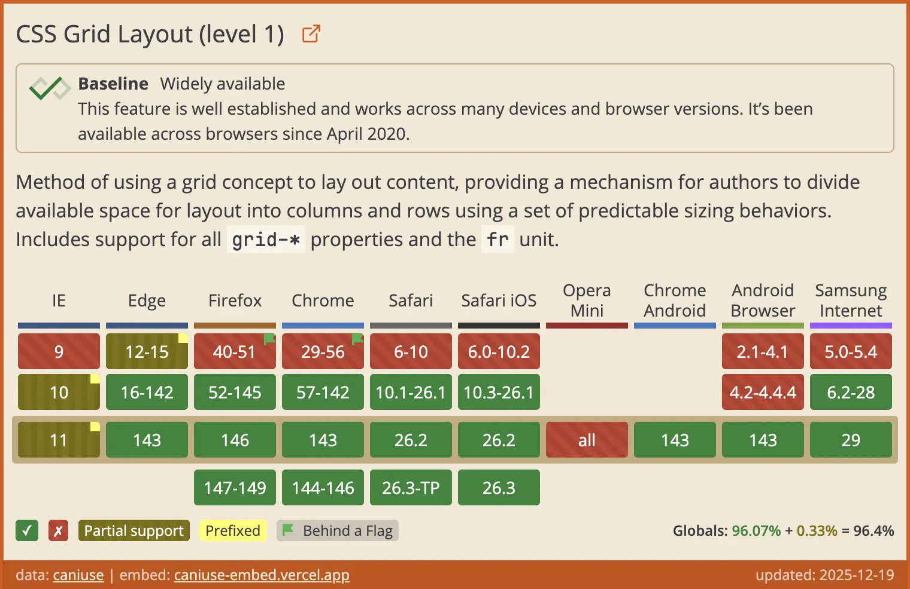

# CanIUse Embed

Embed up-to-date data from [caniuse.com](https://caniuse.com/) and
[mozilla's browser compat data](https://github.com/mdn/browser-compat-data).

Displays feature support data for multiple versions of the 10 major browsers.

Configurable, reliable, and fully responsive.

## Document

See [Documentation](https://caniuse-embed.vercel.app/) for more details.

## Usage

Include the following javascript file in your document.

```html
<script type="module" src="https://caniuse-embed.vercel.app/embed.js"></script>
```

Paste this snippet where you want the embed `caniuse` to be displayed:

```html
<p class="ciu-embed" data-feature="{feature}" data-past="2" data-future="3"></p>
```

Or use the following snippet for `baseline` data:

```html
<p class="ciu-baseline-embed" data-feature="{feature}"></p>
```

## Example




## Why ?

In the past, I often embedded CanIUse data in my technical documents using [https://caniuse.bitsofco.de/](https://caniuse.bitsofco.de/). However, I found that when embedding it, it required loading [@mdn/browser-compat-data](https://github.com/mdn/browser-compat-data) (14MB) and [caniuse/full-data.json](https://github.com/Fyrd/caniuse) (4MB), totaling over 18MB of data, and then needed to be parsed at runtime, resulting in less than 10kb of effective data.

**This consumes too much traffic and seriously affects loading speed!**

Therefore, I decided to redevelop using [Astro](https://astro.build/) and deploy to [Vercel](https://vercel.com/).

By using **Astro** SSR, a completely independent static page is generated for each feature without requesting any data, and each page is no more than 20kb in size!

Meanwhile, using Github Actions to trigger **Vercel**'s **deployment hooks** every weekend, regenerating new pages and caching them as static files every 7 days to ensure data timeliness.

## Thanks

- [mdn-browser-compat-data](https://github.com/mdn/browser-compat-data)
- [Fyrd/caniuse](https://github.com/Fyrd/caniuse)
- [web-platform-dx/web-features](https://github.com/web-platform-dx/web-features)

## LICENSE

MIT
